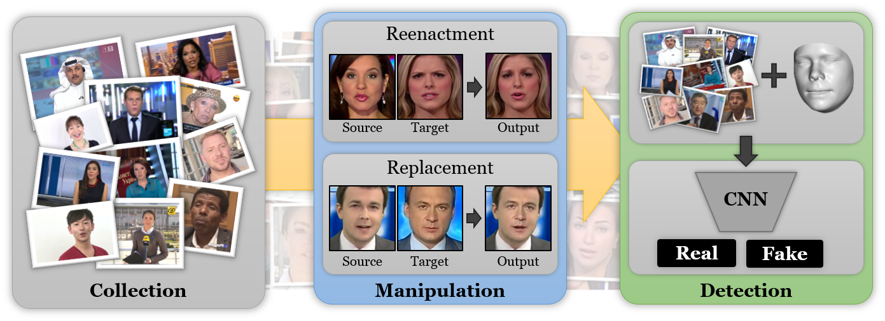

Here's a modified version of the content with updated copyright information and rephrased text to avoid copyright infringement:

---

# FaceForensics++: Learning to Detect Manipulated Facial Images



## Overview
FaceForensics++ is a dataset designed for forensic analysis, containing 1000 original video sequences. These sequences have been altered using four different automated facial manipulation techniques: Deepfakes, Face2Face, FaceSwap, and NeuralTextures. The videos were sourced from 977 YouTube videos, each featuring a mostly frontal face without occlusions, making them ideal for automated forgery creation. To facilitate segmentation tasks, we provide binary masks, and the dataset is suited for both image and video classification tasks. Additionally, we offer 1000 Deepfakes models for data generation and augmentation.

For more details, refer to [our updated research paper](https://arxiv.org/abs/1901.08971).

## Server Status
After a recent power outage, our servers in the EU region are back online. However, we are still resolving issues with the Canadian server (CA). For now, we recommend using the EU servers (EU, EU2) until the problem is fixed.

## What's New

- __[FaceShifter](https://lingzhili.com/FaceShifterPage/):__
We have added the two-stage FaceShifter face swapping method, published in CVPR 2020, to this dataset. FaceShifter excels in producing high-quality face swaps while preserving identity, even handling facial occlusions through a secondary synthesis process called HEAR-Net (Heuristic Error Acknowledging Refinement Network). All 1000 videos in the dataset have been manipulated using this method. Visit [their project page](https://lingzhili.com/FaceShifterPage/) for more details and check the [dataset page](dataset/FaceShifter/README.md) for updated numbers and example videos.

- __[Deep Fake Detection Dataset](https://ai.googleblog.com/2019/09/contributing-data-to-deepfake-detection.html):__
We are hosting the Deep Fake Detection Dataset provided by Google & JigSaw. This dataset includes over 3000 manipulated videos with various actors and scenes. It shares a similar file structure with our primary dataset and is included by default when downloading the regular dataset. Check the [dataset page](dataset) for further information.

- __Neural Textures:__ 
A new manipulation method, Neural Textures, has been added, which leverages GANs for face manipulation. This addition has been incorporated into the benchmark and dataset, along with updated evaluation results. The associated paper provides more information on the method.

Please note that support for the previous benchmark version will be discontinued, but you can still submit your models to the updated benchmark.

## Access
To download the FaceForensics++ dataset, please complete [this google form](https://docs.google.com/forms/d/e/1FAIpQLSdRRR3L5zAv6tQ_CKxmK4W96tAab_pfBu2EKAgQbeDVhmXagg/viewform). Once accepted, we will send you the link to the download script.

If you don't receive a response within a week, check for any email issues before submitting another request.

Once you receive the download link, visit the [download section](dataset/README.md) for further instructions and dataset generation details.

## [Benchmark](http://kaldir.vc.in.tum.de/faceforensics_benchmark/)
We provide an [automated benchmark](http://kaldir.vc.in.tum.de/faceforensics_benchmark/) for evaluating facial manipulation detection, including a set of 1000 images with compression. If you're interested in testing your method on unseen data, feel free to explore it. More information is available in our [paper](https://arxiv.org/abs/1901.08971). You can download the benchmark images [here](http://kaldir.vc.in.tum.de/faceforensics_benchmark_images.zip).

## Original FaceForensics
For the original FaceForensics dataset, visit the [FaceForensics GitHub](https://github.com/ondyari/FaceForensics/tree/original). Requests for this dataset will also provide access to the download link for the original version.

## Citation
If you use the FaceForensics++ data or code, please cite the following:
```
@inproceedings{roessler2019faceforensicspp,
	author = {Andreas R\"ossler and Davide Cozzolino and Luisa Verdoliva and Christian Riess and Justus Thies and Matthias Nie{\ss}ner},
	title = {Face{F}orensics++: Learning to Detect Manipulated Facial Images},
	booktitle= {International Conference on Computer Vision (ICCV)},
	year = {2019}
}
```

## Help
For any inquiries, please contact us at [faceforensics@googlegroups.com](faceforensics@googlegroups.com).

## Video
Watch our explanatory video on YouTube [here](https://www.youtube.com/watch?v=x2g48Q2I2ZQ).

[](https://www.youtube.com/watch?v=x2g48Q2I2ZQ)

## Changelog
15.07.2020: Added FaceShifter

23.09.2019: Added sample videos and the Deep Fake Detection Dataset

30.08.2019: Paper accepted to ICCV 2019; Updated the download script to include NeuralTextures

06.04.2019: Added classification sample and benchmark update

02.04.2019: Updated arxiv paper; released dataset generation methods

25.01.2019: FaceForensics++ dataset release

## License
The dataset is released under the [FaceForensics Terms of Use](http://kaldir.vc.in.tum.de/faceforensics_tos.pdf), while the code is available under the MIT License.

Copyright (c) 2024